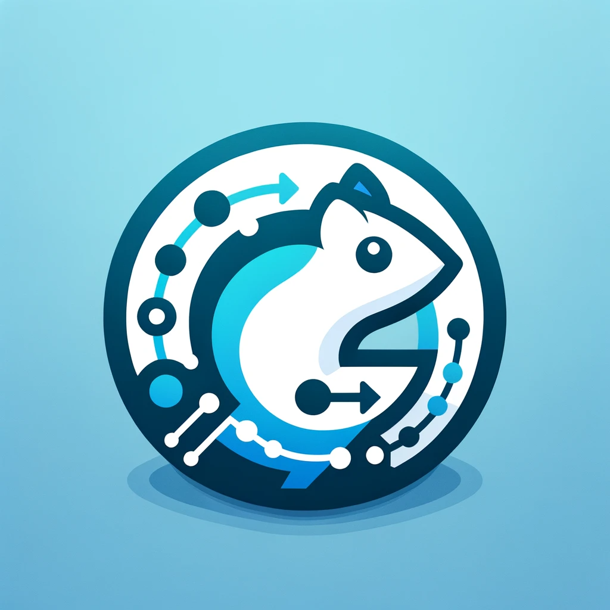

# A thread-safe GoLang CQRS library using mediator pattern

<div align="center">
  
</div>


[](./LICENSE)


GoCQRS is a Go package designed to facilitate the implementation of the Command Query Responsibility Segregation (CQRS) pattern in Go applications. This package provides a straightforward and type-safe way to handle commands, queries, and events within your application.

## Features

- **Type-Safe Handlers**: Utilizes Go generics to ensure type safety across commands, queries, and event handlers.
- **Concurrent Handler Management**: Uses `sync.Map` for managing handlers, ensuring safe concurrent access.
- **Easy Registration of Handlers**: Simplified functions to register command handlers, query handlers, and event handlers.
- **Generic Command and Query Processing**: Provides generic functions `SendCommand` and `SendQuery` for processing commands and queries, ensuring return types match the expected response types.
- **Event Publishing**: Facilitates the publishing of events to all registered handlers, handling errors gracefully.

## Usage

### Adding Handlers

- **Command Handlers**: Register command handlers using `AddCommandHandler`, specifying the command and response types.
- **Query Handlers**: Register query handlers using `AddQueryHandler`, specifying the query and response types.
- **Event Handlers**: Register one or more event handlers for a specific event type using `AddEventHandlers`.

### Sending Commands and Queries

- **SendCommand**: Execute a command and receive a response of the expected type.
- **SendQuery**: Execute a query and receive a response of the expected type.

### Publishing Events

- **PublishEvent**: Publish an event to all registered handlers, handling any errors that occur during the process.

## Installation

To use GoCQRS in your project, you can install it by running:

```go
go get -u github.com/victoragudo/go-cqrs
```

## Import Statement

To import the GoCQRS package into your Go application, use the following import statement:

```go
import gocqrs "github.com/victoragudo/go-cqrs"
```

## Adding a command handler
```go
// Example of adding a command handler and sending a command
gocqrs.AddCommandHandler[YourCommandType, YourResponseType](yourCommandHandler)
response, err := gocqrs.SendCommand[YourResponseType](context.Background(), yourCommand)
```

## Adding a Query Handler
To add a query handler, first define the handler that implements the IQueryHandler interface for your query type and its response type. Then, register this handler using the AddQueryHandler function.

### Suppose you have a query `GetUserQuery` and its response type `User`. Here's how you could register a handler for this query:

```go
type GetUserQuery struct {
    UserID string
}

type User struct {
    ID   string
    Name string
    Age  int
}

type GetUserQueryHandler struct {
    // Implementation of the handler
}

func (h *GetUserQueryHandler) Handle(ctx context.Context, query GetUserQuery) (User, error) {
    // Logic to handle GetUserQuery
}

// In your main function or setup
func main() {
    getUserQueryHandler := &GetUserQueryHandler{}
    gocqrs.AddQueryHandler[GetUserQuery, User](getUserQueryHandler)
    userResponse, err := gocqrs.SendQuery[User](context.Background(), GetUserQuery{UserID: "1234"})
}
```

## Adding Event Handlers
To add event handlers, define each handler implementing the IEventHandler interface for your event type. Then, register these handlers using the AddEventHandlers function.

### Assume you have an event `UserCreatedEvent` and you wish to add multiple handlers for this event. Each handler should implement the `IEventHandler` interface for `UserCreatedEvent`.

```go
type UserCreatedEvent struct {
    UserID string
}

type EmailNotificationHandler struct {
    // Implementation for email notifications
}

func (h *EmailNotificationHandler) Handle(ctx context.Context, event UserCreatedEvent) error {
    // Logic to send an email notification
}

type LogEventHandler struct {
    // Implementation for logging the event
}

func (h *LogEventHandler) Handle(ctx context.Context, event UserCreatedEvent) error {
    // Logic to log the event
}

// In your main function or setup
func main() {
    emailHandler := &EmailNotificationHandler{}
    logHandler := &LogEventHandler{}

    gocqrs.AddEventHandlers[UserCreatedEvent](emailHandler, logHandler)
}
```

## Adding Multiple Event Handlers for a Single Event
Suppose you have an event named UserCreatedEvent, and you want to add two different handlers for this event: one for sending an email notification and another for logging the event.

### In this example, we have an event called `UserCreatedEvent`. We want to add two handlers for this event: `EmailNotificationHandler` and `LogEventHandler`.

```go
type UserCreatedEvent struct {
    UserID string
}

// Handler for sending email notifications
type EmailNotificationHandler struct {
    // Implementation details
}

func (h *EmailNotificationHandler) Handle(ctx context.Context, event UserCreatedEvent) error {
    // Logic to send email notification
    return nil
}

// Handler for logging the event
type LogEventHandler struct {
    // Implementation details
}

func (h *LogEventHandler) Handle(ctx context.Context, event UserCreatedEvent) error {
    // Logic to log the event
    return nil
}

// In your setup or main function
func main() {
    // Instantiate the handlers
    emailHandler := &EmailNotificationHandler{}
    logHandler := &LogEventHandler{}

    // Add both handlers for the UserCreatedEvent
    err := gocqrs.AddEventHandlers[UserCreatedEvent](emailHandler, logHandler)
    if err != nil {
        // Handle the error
    }

    // To publish the event
    err = PublishEvent(context.Background(), UserCreatedEvent{UserID: "12345"})
    if err != nil {
        // Handle the error
    }
}
```

In this example, EmailNotificationHandler and LogEventHandler are two separate implementations for handling the UserCreatedEvent. The AddEventHandlers function is used to register both handlers simultaneously for the same event type. This demonstrates how your GoCQRS package can support multiple handlers for a single event, enabling flexible and modular event-driven architecture in applications.

## Using SendCommand, SendQuery, and PublishEvent as Go Routines
In Go, leveraging concurrency is a common practice to enhance performance and responsiveness. The GoCQRS package is designed with concurrency in mind, allowing you to execute commands, queries, and event publications in parallel using Go routines.

### The `SendCommand`, `SendQuery`, and `PublishEvent` functions in the GoCQRS package can be used as Go routines. This approach is beneficial when you need to process multiple commands, queries, or events concurrently, improving throughput and responsiveness of your application.

```go
// Example of using SendCommand in a Go routine
go func() {
    response, err := gocqrs.SendCommand[YourResponseType](context.Background(), yourCommand)
    if err != nil {
        // Handle error
    }
    // Process response
}()

// Example of using SendQuery in a Go routine
go func() {
    result, err := gocqrs.SendQuery[YourQueryType](context.Background(), yourQuery)
    if err != nil {
        // Handle error
    }
    // Process result
}()

// Example of using PublishEvent in a Go routine
go func() {
    err := gocqrs.PublishEvent(context.Background(), yourEvent)
    if err != nil {
        // Handle error
    }
    // Event published successfully
}()
```

Using these functions as Go routines allows you to efficiently handle multiple operations in parallel, taking full advantage of Go's concurrency model. This approach is particularly useful in scenarios where your application needs to handle high volumes of commands, queries, or events simultaneously.