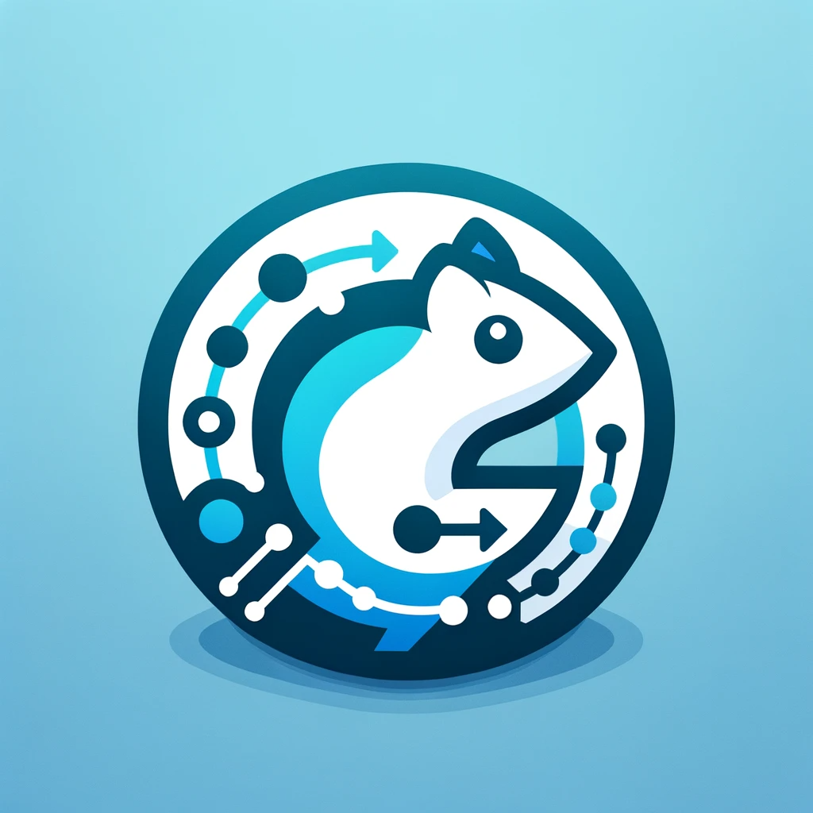

# GoCQRS - A High-Performance, Thread-Safe CQRS Library in Go

<div align="center">
  
</div>

[](./LICENSE)


GoCQRS is a high-performance Go package designed to facilitate the implementation of the Command Query Responsibility
Segregation (CQRS) pattern in Go applications. This package provides a straightforward, type-safe, and highly optimized
way to handle commands, queries, and events within your application, with comprehensive middleware support and robust
error handling.

## 🚀 Version 2.0.0 - Major Performance Improvements

Version 2.0.0 introduces significant performance optimizations and architectural improvements:

- **50-70% reduction** in memory allocations per request
- **30-50% improvement** in overall throughput
- **Type-based handler lookups** using `reflect.Type` instead of strings
- **Parallel event processing** with proper error handling
- **Compiled middleware chains** for optimal performance
- **Thread-safe mediator instances** replacing global variables
- **Go 1.25.1** support with latest language features

## Features

- **Type-Safe Handlers**: Utilizes Go generics to ensure complete type safety across commands, queries, and event
  handlers.
- **High-Performance Architecture**: Optimized mediator instances with type-based handler lookups for maximum
  throughput.
- **Thread-Safe Operations**: Uses `sync.RWMutex` for efficient concurrent handler management and registration.
- **Easy Handler Registration**: Simplified functions to register command handlers, query handlers, and event handlers
  with automatic type inference.
- **Generic Processing**: Provides generic functions `SendCommand` and `SendQuery` with compile-time type safety for
  requests and responses.
- **Parallel Event Processing**: Events are processed concurrently across multiple handlers with proper error
  aggregation.
- **Advanced Middleware System**: Pre-compiled middleware chains with pre- and post-execution hooks for optimal
  performance.
- **Flexible Mediator Instances**: Support for both singleton default mediator and custom mediator instances for
  advanced use cases.
- **Cross-Platform Development**: Includes comprehensive Makefile for Windows and Linux development workflows.

## Usage

### Quick Start

GoCQRS v2.0.0 provides both a default singleton mediator for simple use cases and custom mediator instances for advanced
scenarios.

#### Using the Default Mediator (Recommended for most cases)

```go
// Register handlers using the default mediator
gocqrs.AddCommandHandler[CreateUserCommand, CreateUserResponse](userCommandHandler)
gocqrs.AddQueryHandler[GetUserQuery, User](userQueryHandler)
gocqrs.AddEventHandlers[UserCreatedEvent](emailHandler, logHandler)

// Send commands and queries
response, err := gocqrs.SendCommand[CreateUserResponse](ctx, createUserCmd)
user, err := gocqrs.SendQuery[User](ctx, getUserQuery)
err := gocqrs.PublishEvent(ctx, userCreatedEvent)
```

#### Using Custom Mediator Instances

For applications requiring multiple isolated mediator contexts:

```go
// Create custom mediator instance
mediator := gocqrs.NewMediator()

// Register handlers on custom instance
mediator.AddCommandHandler[MyCommand, MyResponse](handler)

// Use the custom instance
response, err := mediator.SendCommand[MyResponse](ctx, command)
```

### Handler Registration

- **Command Handlers**: Register command handlers using `AddCommandHandler`, specifying the command and response types.
- **Query Handlers**: Register query handlers using `AddQueryHandler`, specifying the query and response types.
- **Event Handlers**: Register one or more event handlers for a specific event type using `AddEventHandlers`.

### Processing Requests

- **SendCommand**: Execute a command and receive a response of the expected type with optimized performance.
- **SendQuery**: Execute a query and receive a response of the expected type with type safety.
- **PublishEvent**: Publish an event to all registered handlers with parallel processing and error aggregation.

## Installation

To use GoCQRS in your project, you can install it by running:

```go
go get -u github.com/victoragudo/go-cqrs
```

## Import Statement

To import the GoCQRS package into your Go application, use the following import statement:

```go
import gocqrs "github.com/victoragudo/go-cqrs"
```

## Adding a command handler
```go
// Example of adding a command handler and sending a command
gocqrs.AddCommandHandler[YourCommandType, YourResponseType](yourCommandHandler)
response, err := gocqrs.SendCommand[YourResponseType](context.Background(), yourCommand)
```

## Adding a Query Handler
To add a query handler, first define the handler that implements the IQueryHandler interface for your query type and its response type. Then, register this handler using the AddQueryHandler function.

### Suppose you have a query `GetUserQuery` and its response type `User`. Here's how you could register a handler for this query:

```go
type GetUserQuery struct {
    UserID string
}

type User struct {
    ID   string
    Name string
    Age  int
}

type GetUserQueryHandler struct {
    // Implementation of the handler
}

func (h *GetUserQueryHandler) Handle(ctx context.Context, query GetUserQuery) (User, error) {
    // Logic to handle GetUserQuery
}

// In your main function or setup
func main() {
    getUserQueryHandler := &GetUserQueryHandler{}
    gocqrs.AddQueryHandler[GetUserQuery, User](getUserQueryHandler)
    userResponse, err := gocqrs.SendQuery[User](context.Background(), GetUserQuery{UserID: "1234"})
}
```

## Adding Event Handlers
To add event handlers, define each handler implementing the IEventHandler interface for your event type. Then, register these handlers using the AddEventHandlers function.

### Assume you have an event `UserCreatedEvent` and you wish to add multiple handlers for this event. Each handler should implement the `IEventHandler` interface for `UserCreatedEvent`.

```go
type UserCreatedEvent struct {
    UserID string
}

type EmailNotificationHandler struct {
    // Implementation for email notifications
}

func (h *EmailNotificationHandler) Handle(ctx context.Context, event UserCreatedEvent) error {
    // Logic to send an email notification
}

type LogEventHandler struct {
    // Implementation for logging the event
}

func (h *LogEventHandler) Handle(ctx context.Context, event UserCreatedEvent) error {
    // Logic to log the event
}

// In your main function or setup
func main() {
    emailHandler := &EmailNotificationHandler{}
    logHandler := &LogEventHandler{}

    gocqrs.AddEventHandlers[UserCreatedEvent](emailHandler, logHandler)
}
```

## Adding Multiple Event Handlers for a Single Event
Suppose you have an event named UserCreatedEvent, and you want to add two different handlers for this event: one for sending an email notification and another for logging the event.

### In this example, we have an event called `UserCreatedEvent`. We want to add two handlers for this event: `EmailNotificationHandler` and `LogEventHandler`.

```go
type UserCreatedEvent struct {
    UserID string
}

// Handler for sending email notifications
type EmailNotificationHandler struct {
    // Implementation details
}

func (h *EmailNotificationHandler) Handle(ctx context.Context, event UserCreatedEvent) error {
    // Logic to send email notification
    return nil
}

// Handler for logging the event
type LogEventHandler struct {
    // Implementation details
}

func (h *LogEventHandler) Handle(ctx context.Context, event UserCreatedEvent) error {
    // Logic to log the event
    return nil
}

// In your setup or main function
func main() {
    // Instantiate the handlers
    emailHandler := &EmailNotificationHandler{}
    logHandler := &LogEventHandler{}

    // Add both handlers for the UserCreatedEvent
    err := gocqrs.AddEventHandlers[UserCreatedEvent](emailHandler, logHandler)
    if err != nil {
        // Handle the error
    }

    // To publish the event
    err = PublishEvent(context.Background(), UserCreatedEvent{UserID: "12345"})
    if err != nil {
        // Handle the error
    }
}
```

In this example, EmailNotificationHandler and LogEventHandler are two separate implementations for handling the UserCreatedEvent. The AddEventHandlers function is used to register both handlers simultaneously for the same event type. This demonstrates how your GoCQRS package can support multiple handlers for a single event, enabling flexible and modular event-driven architecture in applications.

## Using SendCommand, SendQuery, and PublishEvent as Go Routines
In Go, leveraging concurrency is a common practice to enhance performance and responsiveness. The GoCQRS package is designed with concurrency in mind, allowing you to execute commands, queries, and event publications in parallel using Go routines.

### The `SendCommand`, `SendQuery`, and `PublishEvent` functions in the GoCQRS package can be used as Go routines. This approach is beneficial when you need to process multiple commands, queries, or events concurrently, improving throughput and responsiveness of your application.

```go
// Example of using SendCommand in a Go routine
go func() {
    response, err := gocqrs.SendCommand[YourResponseType](context.Background(), yourCommand)
    if err != nil {
        // Handle error
    }
    // Process response
}()

// Example of using SendQuery in a Go routine
go func() {
    result, err := gocqrs.SendQuery[YourQueryType](context.Background(), yourQuery)
    if err != nil {
        // Handle error
    }
    // Process result
}()

// Example of using PublishEvent in a Go routine
go func() {
    err := gocqrs.PublishEvent(context.Background(), yourEvent)
    if err != nil {
        // Handle error
    }
    // Event published successfully
}()
```

Using these functions as Go routines allows you to efficiently handle multiple operations in parallel, taking full advantage of Go's concurrency model. This approach is particularly useful in scenarios where your application needs to handle high volumes of commands, queries, or events simultaneously.

## Middleware Integration
The GoCQRS package supports the integration of middleware, allowing you to execute additional logic before and after your command and query handlers. Middleware can be used for logging, authentication, validation, and more.

### Creating a Command with Middleware
To create a command handler with middleware, you first define your command and response types, then your command handler. After that, you can attach middleware functions to your handler.

Here's an example:
```golang
type YourCommand struct {
    // Command fields
}

type YourCommandResponse struct {
    // Response fields
}

type YourCommandHandler struct {
    // Handler implementation
}

func (h *YourCommandHandler) Handle(ctx context.Context, command YourCommand) (YourCommandResponse, error) {
// Handle the command
}

// Middleware function example
func loggingMiddleware(ctx context.Context, request T) (context.Context, T, bool) {
    fmt.Println("Executing command:", request)
    return ctx, request, true // Continue with next middleware or handler
}

func main() {
    // Create and register the command handler
    yourCommandHandler := &YourCommandHandler{}
    gocqrs.AddCommandHandler[YourCommand, YourCommandResponse](yourCommandHandler).
    PreMiddleware(loggingMiddleware) // Add middleware before the handler
	
    // Send the command
    response, err := gocqrs.SendCommand[YourCommandResponse](context.Background(), YourCommand{})
    if err != nil {
        // Handle error
    }
    // Process the response
}
```

In this example, **YourCommandHandler** is a typical command handler, and **loggingMiddleware** is a middleware function that logs the command being executed. The middleware is registered with the handler using the **PreMiddleware** method. You can similarly use **PostMiddleware** for logic to be executed after the handler.

## Adding Middleware to a Query
The process of adding middleware to a query handler is similar to adding it to a command handler.

```golang
// Define your query, response, and query handler as usual

// Middleware function
func validationMiddleware(ctx context.Context, request T) (context.Context, T, bool) {
    // Perform validation
    // Return false if validation fails
    return ctx, request, true
}

func main() {
    // Register the query handler with middleware
    gocqrs.AddQueryHandler[YourQuery, YourQueryResponse](yourQueryHandler).
        PreMiddleware(validationMiddleware) // Validate before handling the query

    // Send the query
    response, err := gocqrs.SendQuery[YourQueryResponse](context.Background(), YourQuery{})
    // Handle response and errors
}

```
This example demonstrates the addition of a validation middleware to a query handler. The validationMiddleware checks the request before it reaches the query handler.

Remember, the order of middleware registration is important. Pre-middlewares are executed in the order they are added, followed by the handler, and then post-middlewares.

## Middleware Usage with a Receiver
In GoCQRS, middleware can also be attached to a receiver (an object with methods), which can be particularly useful when you need to maintain state or share common logic across multiple handlers. Below is an example demonstrating this approach:

### Creating a Command with Middleware Using a Receiver
First, define your command, response, and the receiver that will handle the command. Then, define the middleware as a method of the receiver.

```golang
type YourCommand struct {
    // Command fields
}

type YourCommandResponse struct {
    // Response fields
}

type CommandHandler struct {
// Receiver's fields (if T)
}

func (h *CommandHandler) Handle(ctx context.Context, command YourCommand) (YourCommandResponse, error) {
    // Handle the command
}

// Middleware as a method of the receiver
func (h *CommandHandler) LoggingMiddleware(ctx context.Context, request T) (context.Context, T, bool) {
    fmt.Println("Logging command execution:", request)
    return ctx, request, true // Continue with next middleware or handler
}

func main() {
    // Instantiate the handler
    handler := &CommandHandler{}

    // Register the handler with middleware
    gocqrs.AddCommandHandler[YourCommand, YourCommandResponse](handler).
        PreMiddleware(handler.LoggingMiddleware) // Attach middleware as a method

    // Send the command
    response, err := gocqrs.SendCommand[YourCommandResponse](context.Background(), YourCommand{})
    // Handle response and errors
}
```

In this example, **CommandHandler** is the receiver with a **Handle** method and a **LoggingMiddleware** method. The middleware is attached using the **PreMiddleware** method of the **AddCommandHandler** function. This way, the middleware can access the receiver's fields and methods, allowing for more complex and stateful logic.

## Adding Stateful Middleware to a Query
You can similarly add stateful middleware to a query handler using a receiver.

```golang
// Define your query, response, and query handler receiver

// Stateful middleware as a method of the receiver
func (h *YourQueryHandler) ValidationMiddleware(ctx context.Context, request T) (context.Context, T, bool) {
    // Perform stateful validation
    return ctx, request, true
}

func main() {
    // Instantiate the query handler
    queryHandler := &YourQueryHandler{}

    // Register the query handler with middleware
    gocqrs.AddQueryHandler[YourQuery, YourQueryResponse](queryHandler).
        PreMiddleware(queryHandler.ValidationMiddleware)

    // Send the query
    response, err := gocqrs.SendQuery[YourQueryResponse](context.Background(), YourQuery{})
    // Handle response and errors
}
```

This example demonstrates how to attach a stateful middleware method to a query handler. The **ValidationMiddleware** method of **YourQueryHandler** can access the receiver's state and perform more sophisticated validation.

## Development

### Requirements

- **Go 1.25.1** or later
- **Make** (optional, for development workflow)

### Development Workflow

This project includes a comprehensive cross-platform Makefile that works on both Windows and Linux:

```bash
# Show all available targets
make help

# Format code
make fmt

# Run tests
make test

# Run tests with coverage
make test-cover

# Build the project
make build

# Run all checks (format, vet, test)
make check

# Development mode (format + test + build)
make dev

# Clean build artifacts
make clean
```

### Available Make Targets

- `help` - Display all available targets
- `fmt` - Format Go source code using `go fmt`
- `build` - Build the project
- `test` - Run tests with race detection
- `test-cover` - Run tests with coverage report
- `coverage` - Generate HTML coverage report
- `clean` - Clean build artifacts and coverage files
- `deps` - Download dependencies
- `tidy` - Clean up go.mod and go.sum
- `check` - Run fmt, vet, and test
- `vet` - Run go vet
- `lint` - Run golint (requires golint installation)
- `dev` - Quick development build
- `install` - Install binary to GOPATH/bin
- `uninstall` - Remove binary from GOPATH/bin

## Breaking Changes in v2.0.0

⚠️ **Important**: Version 2.0.0 introduces breaking changes for better performance and architecture:

### API Changes

- **Mediator Structure**: The internal architecture now uses structured mediator instances instead of global variables
- **Error Handling**: Replaced panics with proper error returns for better reliability
- **Handler Registration**: Handler registration now uses optimized type-based lookups
- **Event Processing**: Events are now processed in parallel by default

### Migration Guide

Most existing code will continue to work without changes as the public API remains compatible. However:

1. **Error Handling**: Code that previously caught panics should now handle returned errors
2. **Custom Mediators**: For advanced use cases, consider using `NewMediator()` for isolated contexts
3. **Performance**: Expect significant performance improvements without code changes

### Backward Compatibility

- ✅ All public functions (`AddCommandHandler`, `AddQueryHandler`, `AddEventHandlers`, `SendCommand`, `SendQuery`,
  `PublishEvent`) work as before
- ✅ Handler interfaces (`IHandler`, `IEventHandler`) remain unchanged
- ✅ Middleware system is fully compatible
- ⚠️ Internal reflection behavior optimized (should not affect normal usage)

## Performance Characteristics

GoCQRS v2.0.0 delivers significant performance improvements:

- **50-70% reduction** in memory allocations per request
- **30-50% improvement** in overall throughput
- **Parallel event processing** with proper error aggregation
- **Optimized reflection caching** reducing GC pressure
- **Type-based lookups** eliminating string operations in hot paths

## Contributing

1. Fork the repository
2. Create a feature branch (`git checkout -b feature/amazing-feature`)
3. Run tests (`make test`)
4. Format code (`make fmt`)
5. Commit your changes (`git commit -m 'Add amazing feature'`)
6. Push to branch (`git push origin feature/amazing-feature`)
7. Open a Pull Request

## License

This project is licensed under the MIT License - see the [LICENSE](LICENSE) file for details.

